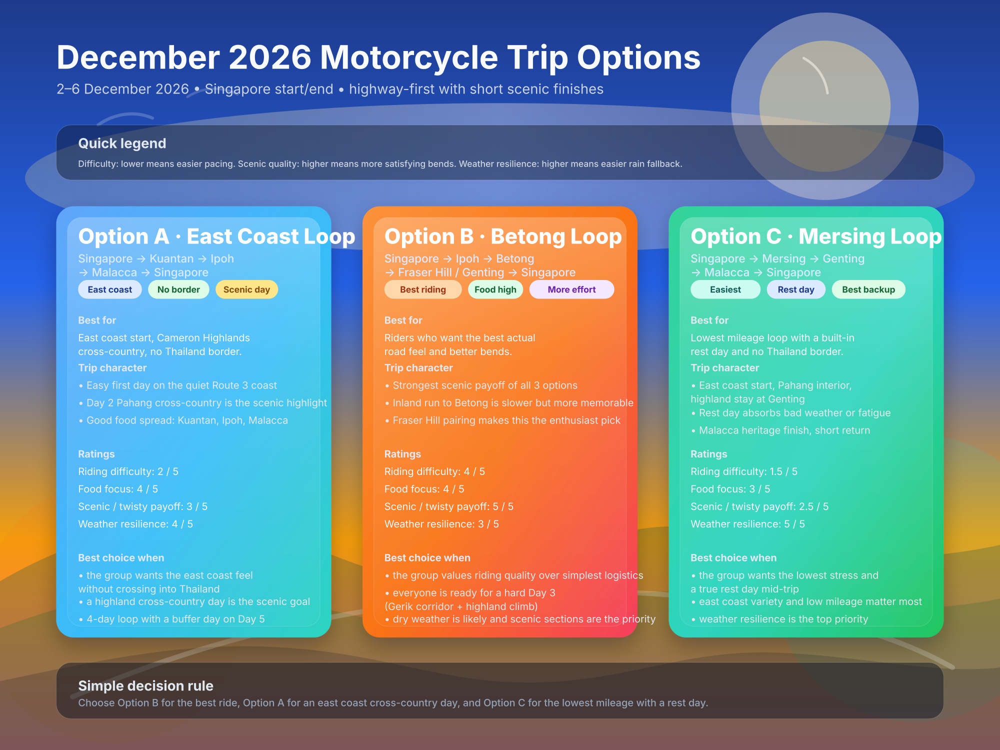

# December 2026 Motorcycle Trip Companion Guide

**Trip window:** 2-6 December 2026  
**Companion to:** `travel.md`  
**Purpose:** help the group compare all 3 route options quickly, choose hotel areas that make breakfast and parking easier, lock in realistic departure windows, and run a final bike/document prep.

## Visual Summary

---

## Quick Comparison Across All 3 Trip Options

| Option | Route | Best for | Riding difficulty | Food focus | Scenic/twisty quality | Border complexity | Weather resilience | Best fit summary |
|---|---|---|---|---|---|---|---|---|
| **Option A** | Singapore -> Kuantan -> Ipoh -> Malacca -> Singapore | Riders who want an east coast start and a cross-country highland day with no Thailand border | **Low** | **Good** | **Moderate**, Day 2 Cameron Highlands approach is the highlight | **Low** | **Good** | Best for a 4-day east coast loop with a scenic inland centrepiece |
| **Option B** | Singapore -> Ipoh -> Betong -> Fraser Hill / Genting -> Singapore | Riders who want the best actual road feel and are ready for a hard Day 3 | **High** | **Good** | **Best** of the 3, Gerik corridor plus highland climb on Day 3 | **Medium** | **Fair to good** if rain backups are used early | Best for riders who care more about the ride than the destination |
| **Option C** | Singapore -> Mersing -> Genting -> Malacca -> Singapore | Riders who want the lowest mileage, a rest day built in, and no Thailand border | **Easiest** | **Moderate** | **Low to moderate** | **Low** | **Best** | Best for groups who want low stress, a highland stop, and a heritage finish |

### Fast recommendation matrix

| If the group wants... | Best option |
|---|---|
| easiest logistics and lowest mileage | **Option C** |
| best riding satisfaction | **Option B** |
| east coast start with a cross-country day | **Option A** |
| a built-in rest day | **Option C** |
| strongest riding plus scenic balance | **Option B** |
| best option for mixed experience riders | **Option C** or **Option A** |

---

## Recommended Hotel Area by Overnight Stop

The goal here is simple: easier bike parking, better breakfast access, and less stressful morning rollout.

### Option A - Kuantan / Ipoh / Malacca loop

| Stop | Recommended hotel area | Why it works | Watch out for |
|---|---|---|---|
| **Kuantan** | `Town centre near the main commercial belt` | Easy parking, walkable dinner, clean highway exit next morning | Avoid the beach resort strip if you want a simple rollout |
| **Ipoh** | `New Town edge` or `Old Town fringe` | Easier parking, quick breakfast access, simple highway exit | Tight heritage streets if you stay too deep in Old Town |
| **Malacca** | `Heritage fringe / riverside fringe / easy parking hotel block` | Walkable dinner without forcing bikes into tight tourist streets | Central heritage streets are slower at peak hours |

### Option B - Betong loop

| Stop | Recommended hotel area | Why it works | Watch out for |
|---|---|---|---|
| **Ipoh** | `New Town edge` or `Old Town fringe` | Easier parking, quick breakfast access, leave early for Betong | Tight heritage streets if too central |
| **Betong** | `Town center but not directly on the busiest nightlife strip` | Easy walk to dinner and breakfast, simpler departure next day | Noise and slower exit if staying in the most crowded zone |
| **Fraser Hill** | `Main hill hotel cluster` | Simplest scenic stay, short morning rollout | Limited backup choices if fully booked |
| **Genting** | `Main developed hotel zone` | Best fallback for rain or fatigue on Day 3 | Urbanized feel compared with Fraser |

### Option C - Mersing / Genting / Malacca loop

| Stop | Recommended hotel area | Why it works | Watch out for |
|---|---|---|---|
| **Mersing** | `Town centre near the waterfront` | Easy parking, good seafood dinner options, clean departure next morning | Limited hotel variety; book early |
| **Genting** | `Main developed hotel zone` | Best weather fallback, easy parking structure, rest day facilities | More urban and less charming than Fraser Hill |
| **Malacca** | `Heritage fringe / riverside fringe / easy parking hotel block` | Walkable dinner without forcing bikes into tight tourist streets | Central heritage streets are slower at peak hours |

---

## Suggested Daily Departure Windows

These windows aim to preserve the highway-first approach while leaving room for breakfast and a final scenic finish.

### Option A - Kuantan / Ipoh / Malacca loop

| Day | Route | Approx km | Ideal wheels-rolling time | Breakfast strategy | Why |
|---|---|---:|---|---|---|
| **Day 1** | Singapore -> Kuantan | 260-300 km | **7:00-7:30 a.m.** | light breakfast before or after border | Short day, no need to rush — settle in on Route 3 |
| **Day 2** | Kuantan -> Ipoh | 350-420 km | **6:45-7:15 a.m.** | quick breakfast near hotel | Longest day; the interior roads are slower than they look |
| **Day 3** | Ipoh -> Malacca | 380-430 km | **7:30-8:00 a.m.** | breakfast near hotel | Keeps Malacca arrival out of peak tourist traffic |
| **Day 4** | Malacca -> Singapore | 220-270 km | **8:00-8:30 a.m.** | easy hotel or old-town breakfast | Shortest and simplest final day |

### Option B - Betong loop

| Day | Route | Approx km | Ideal wheels-rolling time | Breakfast strategy | Why |
|---|---|---:|---|---|---|
| **Day 1** | Singapore -> Ipoh | 560-620 km | **6:00-6:30 a.m.** | very light start or eat after border | Protects buffer for the longest first day |
| **Day 2** | Ipoh -> Betong | 290-360 km | **6:45-7:15 a.m.** | quick breakfast near hotel | The inland section is slower than it looks; do not leave late |
| **Day 3** | Betong -> Fraser Hill / Genting | 340-450 km | **6:30-7:00 a.m.** | market or hotel breakfast, leave early | Hardest day: border + Gerik corridor + highland climb all in one |
| **Day 4** | Highlands -> Singapore | 350-500 km | **7:30-8:00 a.m.** | hotel breakfast | Easiest closeout |

### Option C - Mersing / Genting / Malacca loop

| Day | Route | Approx km | Ideal wheels-rolling time | Breakfast strategy | Why |
|---|---|---:|---|---|---|
| **Day 1** | Singapore -> Mersing | 185-215 km | **7:30-8:00 a.m.** | light breakfast before or after border | Shortest day; no need to push early |
| **Day 2** | Mersing -> Genting | 280-360 km | **7:00-7:30 a.m.** | kopitiam breakfast near hotel | Longest riding day on this loop; leave with some buffer |
| **Day 3** | Rest day at Genting | 0-80 km | flexible | hotel or Gohtong Jaya cafe | Rest day; any optional ride should be done before noon |
| **Day 4** | Genting -> Malacca | 180-230 km | **8:00-8:30 a.m.** | hotel or coffee chain before descent | Short comfortable day after the rest |
| **Day 5** | Malacca -> Singapore | 220-270 km | **8:00-8:30 a.m.** | easy hotel or old-town breakfast | Shortest and simplest final day |

---

## Bike Prep Checklist

### 2 weeks before departure

- Service the bike if service interval is close.
- Check tires for remaining life, sidewall condition, and puncture history.
- Check brake pad thickness and brake fluid feel.
- Check chain and sprocket wear, especially if planning wet riding.
- Confirm battery health and charging.
- Test all lights, horn, USB charging, and navigation mount.
- Confirm luggage mounts are tight and waterproofing is adequate.

### 3-5 days before departure

- Set tire pressures for loaded touring, not solo commuting.
- Lube and tension the chain.
- Check coolant and engine oil levels.
- Confirm rain gear, gloves, visor, and anti-fog setup.
- Download offline maps for Singapore, Malaysia, and Thailand if applicable.
- Share the route and hotel list with all riders.

### Night before departure

- Full tank if possible.
- Cash split into toll / fuel / emergency categories.
- Phone, intercom, power bank, and camera fully charged.
- Put passport and vehicle documents in a waterproof pouch.
- Set the first fuel stop and regroup stop in navigation so the morning starts clean.

---

## Rider Packing Checklist

### Essential documents

- Passport / travel document
- Driving licence and any required permit
- Vehicle registration / authorization documents
- Insurance documents for Malaysia and Thailand legs where relevant
- Hotel confirmations
- Emergency contacts

### Riding essentials

- Rain suit
- Spare gloves or inner gloves
- Earplugs
- Neck tube / buff
- Clear visor or night-riding eyewear option
- Compact tire repair kit
- Mini inflator or CO2 kit
- Basic tool roll
- Chain lube
- Phone mount backup strap
- Charging cables and power bank

### Personal extras worth bringing

- Hydration pack or water bottle
- Small snacks for border delays
- Pain relief / personal medication
- Microfiber cloth for visor cleaning
- Sandals / light shoes for evenings
- Laundry bag

---

## Group Ride Operating Rules

These are worth agreeing on before the first day.

1. **Fuel together, not individually.**
2. **If one rider needs a stop, the whole group knows early.**
3. **No surprise scenic detours once the weather turns.**
4. **Lunch stops should be decided one fuel stop ahead.**
5. **No one enters the final scenic section tired, hungry, or low on fuel.**
6. **If arrival drifts too late, skip scenery and protect the next day.**

---

## Suggested Best-Use Cases

### Choose Option A if
- the group wants the east coast feel and a quieter first day,
- a cross-country highland day through Pahang is the scenic goal,
- no Thailand border is preferred and a 4-day loop with a buffer day suits the window.

### Choose Option B if
- the group is comfortable with a hard Day 3 (border + Gerik corridor + highland climb),
- the bikes and riders are happier on bendier roads,
- the trip should feel like a proper ride, not just a relocation between meals.

### Choose Option C if
- the group wants the lowest mileage and the least stress,
- a built-in rest day mid-trip is a priority,
- weather resilience and an easy fallback matter most.

---

## Practical Final Recommendation

If you want one simple rule:

- **Best pure riding choice:** `Option B`
- **Best easygoing comfort choice:** `Option C`
- **Best east coast cross-country loop:** `Option A`

If the group is still undecided, use `Option C` as the safe default and `Option B` as the enthusiast pick.

